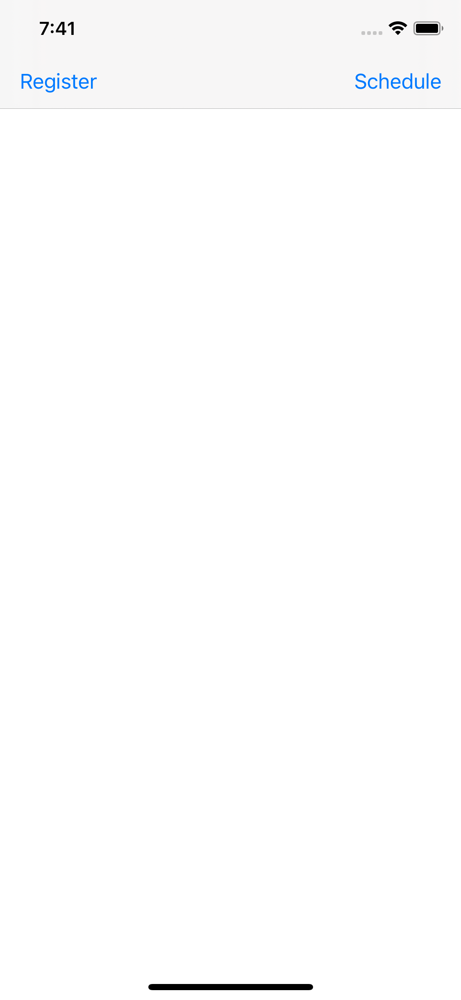
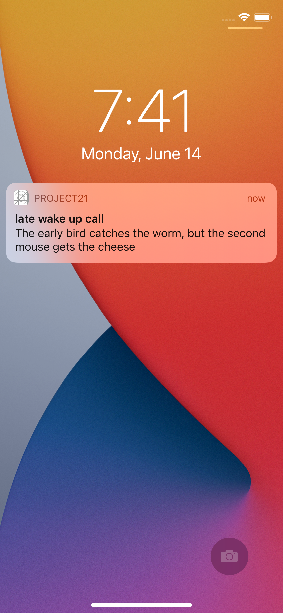
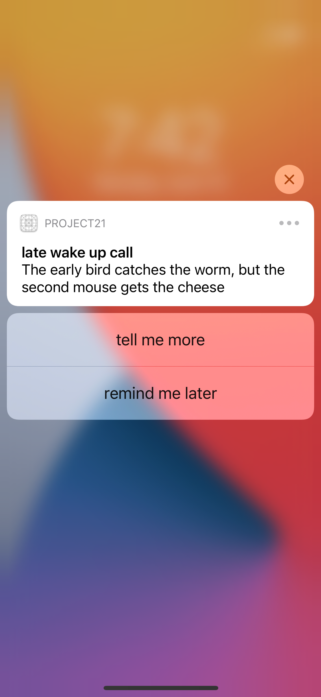

# Notifications
The app designed to provide notification on locked screen. 
## Tools implemented in project
- requestAuthorization
- UNUserNotificationCenter
- DateComponents
- UNMutableNotificationContent
- UNNotificationSound
- UUID
- center.removeAllPendingNotificationRequests
- UNTimeIntervalNotificationTrigger
 ## Project Screen Shots

 

## More features soon 
- repeating
- image inside notifications
## Conclusion 
It was an interesting project which helped me to understand how works Notification center.
Even though it was a basic app, it was challenging for me and takes lots of efforts to finish.
I'm satisfied with the work I've done and will return to make this up even more beautiful.
